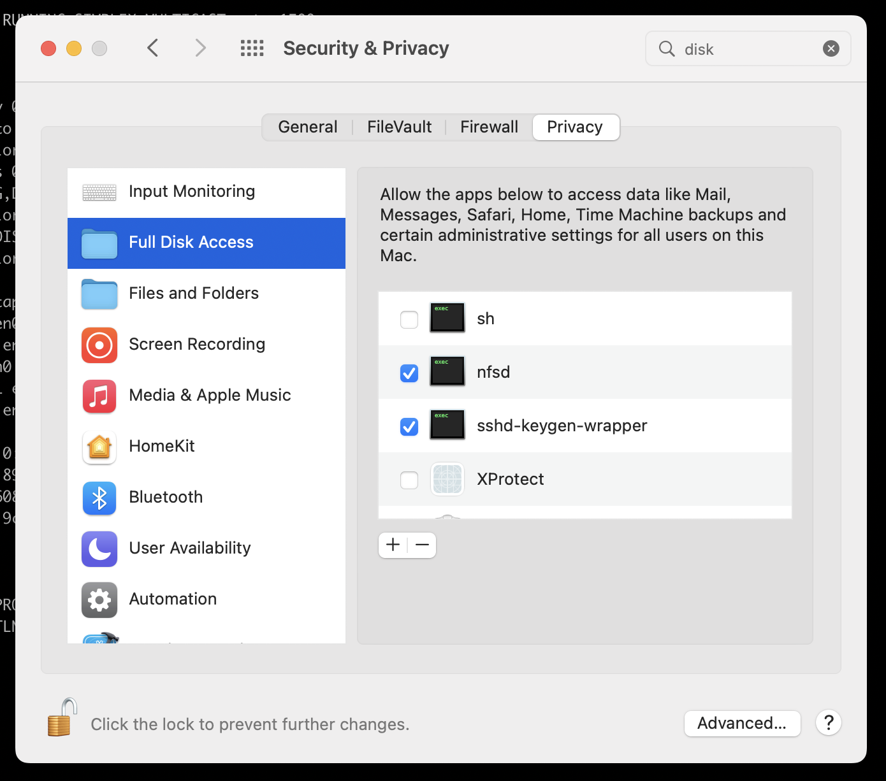

# NFS Daemon Setup Instructions

> NOTE: Samba Share has proven to be 2x better at file sharing

## MacOS Host
Enable full disk access to `nfsd` using `Security & Privacy`



```sh
PATH_TO_THIS_REPO=/Users/krishnagupta/Documents/git-repos/dotfiles

sudo nfsd -F ${PATH_TO_THIS_REPO}/nfsd/exports checkexports && \
sudo cp ${PATH_TO_THIS_REPO}/nfsd/exports /etc/exports && \
sudo nfsd checkexports && \
sudo nfsd restart
```

## NFS Server Tuning
> _Following are the possible tuning parameters. Benchmarking Pending_

All tunables available on the man page `nfs.conf(5)`

add the following in `/etc/nfs.conf`
```ini
nfs.server.nfsd_threads=18
nfs.server.async=1
nfs.server.udp=1
```

`sudo nfsd update` to reflect the changes

