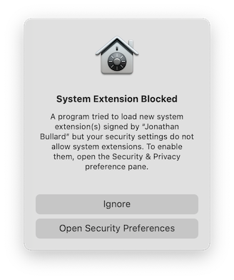
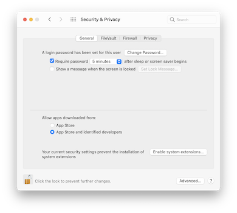
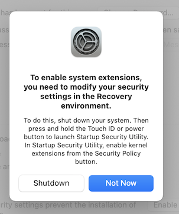

# Aarch 64 VM on M1
## Usage
### 1. Get ISO
VM from installation ISO on Apple Silicon.

ISO from: https://cdimage.ubuntu.com/focal/daily-live/current/ 

### 2. Install TAP device Kernel Extensions on host (Mac OS)
```sh
cd /tmp 
git clone https://github.com/Tunnelblick/Tunnelblick/
sudo cp -r /private/tmp/Tunnelblick/third_party/tap-notarized.kext /Library/Extensions/
sudo cp -r /PATH/TO/THIS/REPO/qemu-aarch64/net.tunnelblick.tap.plist /Library/LaunchDaemons/
```
If you get prompted with a dialog similar to the following, follow the instructions on dialog 

 
<br />
 
<br />


Or Open `Preferences` > `Security & Privacy` and follow the instructions from there. 

**Either way you would need to restart your Mac in recovery mode and allow the loading of kernel extensions**

After allowing kernel extensions in Recover mode, reboot your Mac and open `Preferences` > `Security & Privacy` to 'Allow' the Tap kernel extensions you copied earlier. A Restart may be required.

> 💡 If `kextstat` does not show net.tunnelblick.tap in the list, use `sudo kextload /Library/Extensions/tap-notarized.kext`. \
Will be needed on each bootup

<!-- **In a separate shell, which you make sure to keep alive**
```sh
sudo su - 
exec 4<>/dev/tap0  # opens device, creates interface tap0
ifconfig tap0
ifconfig tap0 inet 10.0.2.9/24 #assign some value to tap0
``` -->

### 3. Run the <a href="from-iso.sh">Script</a>
In the first time usage, you would want to install the OS on a virtual disk (qcow2), so **make sure to uncomment the lines** in the script which have the comment `#Only during OS install`
```sh
cd ~/Documents/virtual-machines/ubuntuaarch64
sudo /PATH/TO/THIS/REPO/qemu-aarch64/from-iso.sh
```


### 4. Setup the Bridge Interface. 📝 _TODO: move this section to from-iso.sh_
```sh
sudo ifconfig en0 inet 192.253.255.1/24 alias
sudo ifconfig bridge create # create a bridge interface
sudo ifconfig bridge1 addm tap0 addm en0 # add en0 and tap0 as member to bridge1
sudo ifconfig bridge1 up
```

### 5. Overwrite the vm address using Serial 📝 _TODO: move this section to from-iso.sh_
```sh
sudo ip addr add 192.253.255.2/24 dev enp0s3
echo  "192.253.255.1 host_machine" >> /etc/hosts
```

### Mounting host shared directory
[Follow the instructions from smbd](../smbd/README.md#mount-on-linux-guest)


## Status
- [x] boot and install
- [x] shutdown and starts
- [x] ssh from host (using tap device)
- [x] host dir share
- [ ] automount dir share
- [ ] get vm ip automatically and use while mounting nfs drive, ssh_config
- [ ] move back redirecting monitor to stdio, instead of serial
- [ ] optimize nfs performance using cache
- [ ] Configure LockD with NFSD, if not already configured. Reason: `rspec` `resultset.json.lock` lock error
- [ ] test on reboot: kext loads up.
- [ ] deny installation of kernel extensions by user using Mac OS _Recovery Mode_
- [ ] Vendor the TunnelBlick repo in this repo
- [ ] Instead of en0, use something else so that change in host wifi/eth does not disrupt nfs and ssh etc

