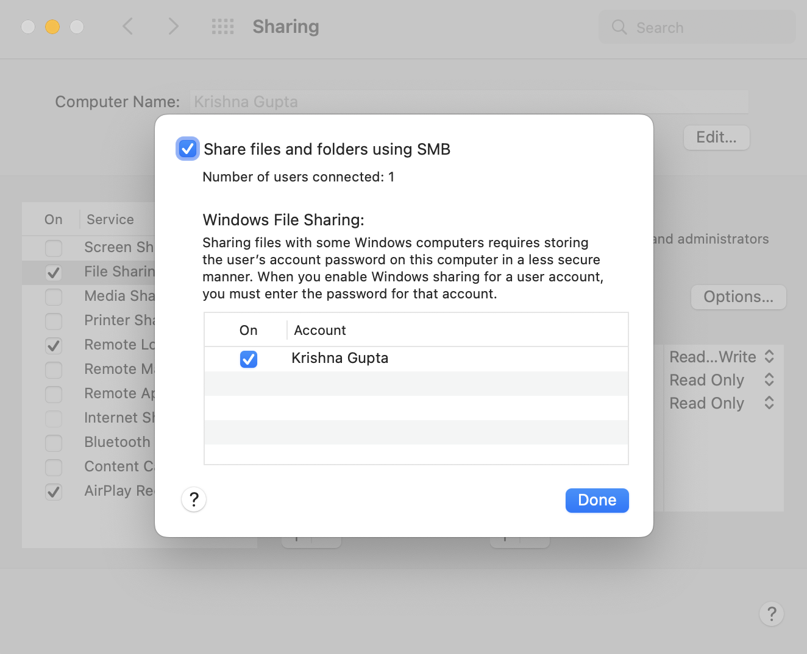

# Setup SMBD on Mac Os
- Open Finder -> Right click on a folder you want to share -> Get Info -> Tick mark 'Shared folder'
- Remember to click on 'Options' and enable your account for 'Windows File Sharing'. Picture below

    

# Mount on linux guest
```sh
sudo apt install cifs-utils
cat << EOF > ~/samba-share-creds
username=Krishna Gupta
password=****
EOF
chmod 400 ~/samba-share-creds
mount -t cifs -o rw,vers=3.0,cache=loose,nostrictsync,handlecache,fsc,actimeo=60,credentials=$(readlink -f ~/samba-share-creds) //host_machine/git-repos /mnt
```

`/etc/fstab` entry
```sh
//host_machine/git-repos /mnt cifs rw,vers=3.0,cache=loose,nostrictsync,handlecache,fsc,actimeo=60,credentials=/root/samba-share-creds
```